# JDR To Aru DMG Dice Calculator

Application desktop Python/Pygame pour gérer une session JDR, manipuler les ressources du jeu (personnages, objets, sorts) et résoudre les actions (Strike, Shoot, Cast Spell).

## Sommaire

- [Release (dernière version)](#release-dernière-version)
- [Aperçu](#aperçu)
- [Images](#images)
- [GIFs de démo](#gifs-de-démo)
- [UI ↔ JSON (cards)](#ui--json-cards)
- [Tutoriel complet: Fiche personnage](#tutoriel-complet-fiche-personnage)
- [Fonctionnalités](#fonctionnalités)
- [Installation](#installation)
- [Utilisation rapide](#utilisation-rapide)
- [Structure du projet](#structure-du-projet)
- [Formats JSON](#formats-json)
- [Mécanique des formules de sorts](#mécanique-des-formules-de-sorts)
- [Dépannage](#dépannage)

## Release (dernière version)

> 🚀 **Télécharger la dernière release :**
> 
> [](https://github.com/Lightpearl26/JDR-To-Aru-Dmg-dice-calculator/releases/latest)
>
> [👉 Ouvrir la page de téléchargement](https://github.com/Lightpearl26/JDR-To-Aru-Dmg-dice-calculator/releases/latest)

## Aperçu

- Interface principale en onglets: `Session`, `Combat`, `Ressources`
- Gestion des ressources en JSON depuis l’UI (`Create`, `Load`, `Modify`, `Remove`)
- Actions de combat assistées avec dés `d100`:
  - `Strike` (attaquant vs cible)
  - `Shoot` (tireur vs cible)
  - `Cast Spell` (lanceur, sort, cible + dés personnalisés)
- Cartes personnages avec accès rapide à la fiche détaillée
- Sauvegarde de session via bouton `Sauvegarder` (JSON + fiche PNG)
- Logs techniques générés dans `cache/logs`

## Images

Les visuels ci-dessous sont générés depuis les widgets du projet.

### Widgets principaux (captures)

| CharacterCard | ItemCard |
|---|---|
| 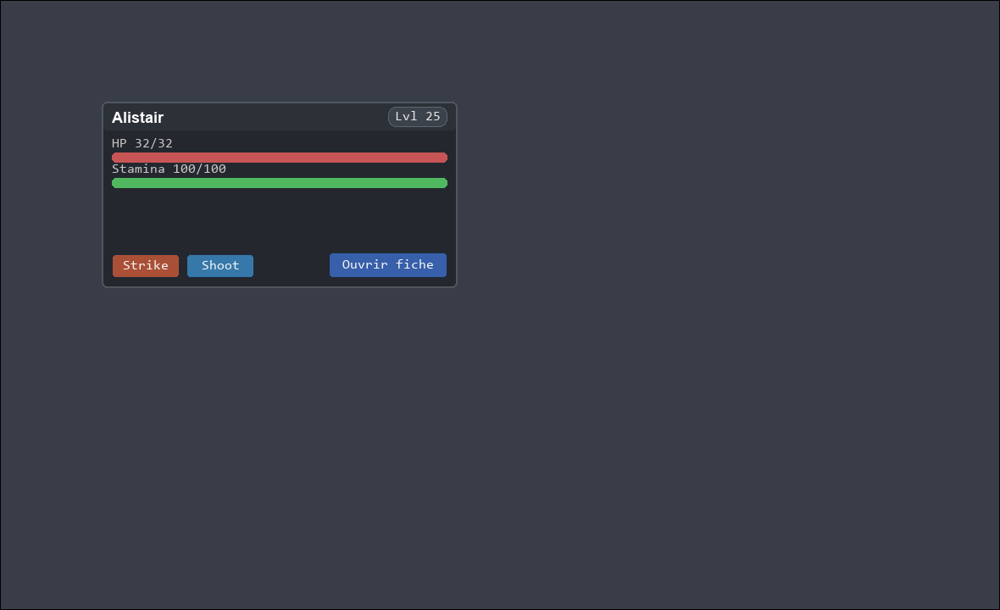 | 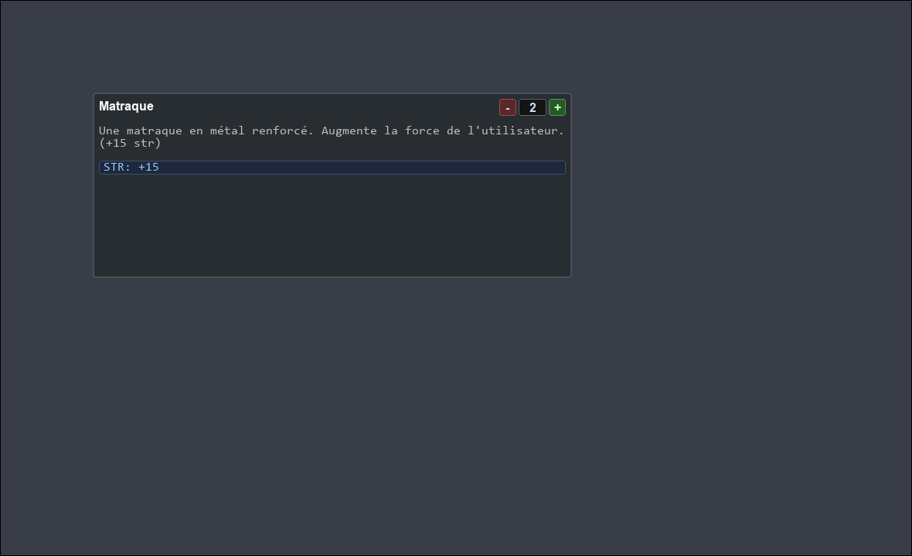 |

| SpellCard |
|---|
| 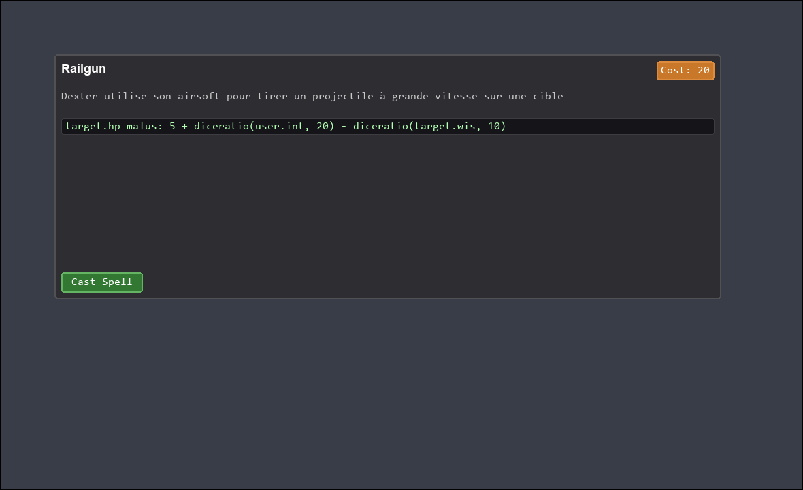 |

### CharacterSheetWidget (captures)

| Onglet Stats | Popup DiceCheck |
|---|---|
| 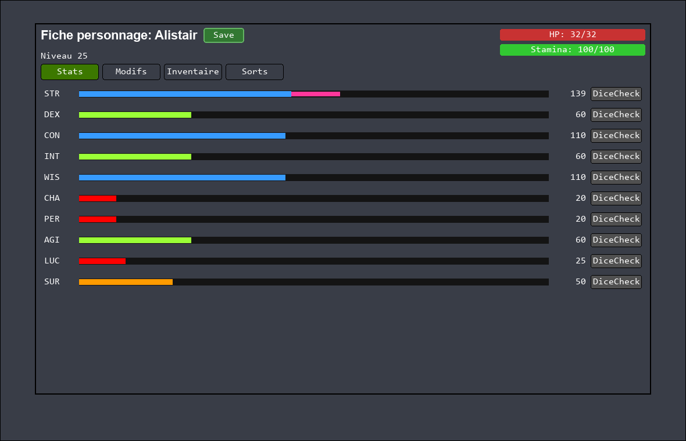 | 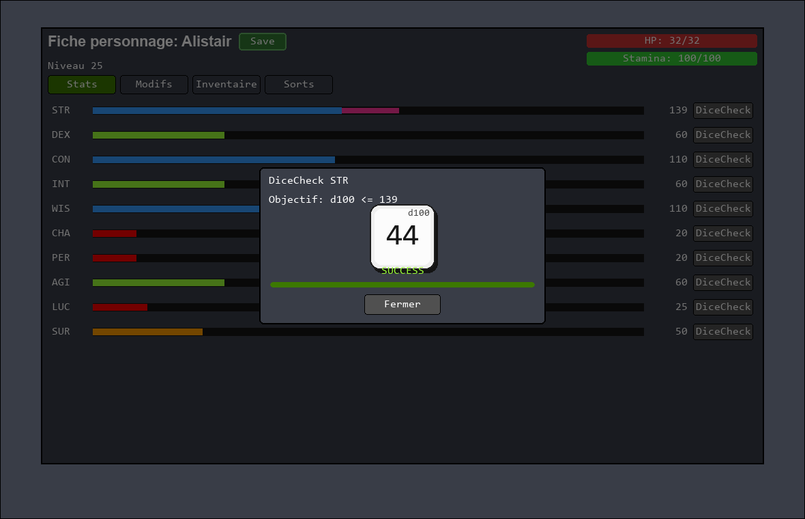 |

| Onglet Modifs | Onglet Inventaire |
|---|---|
| 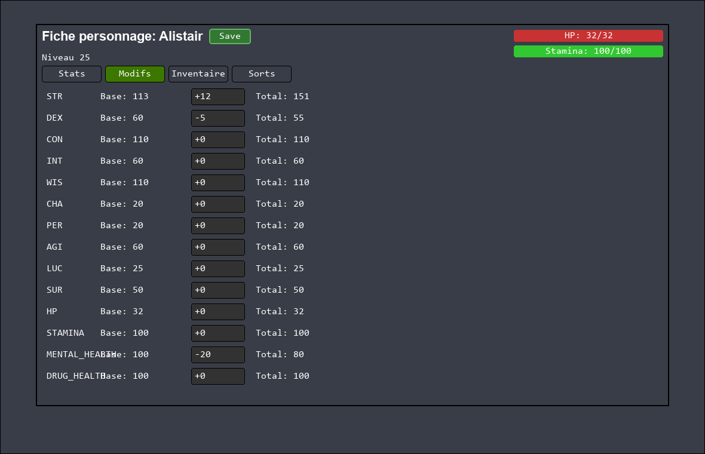 | 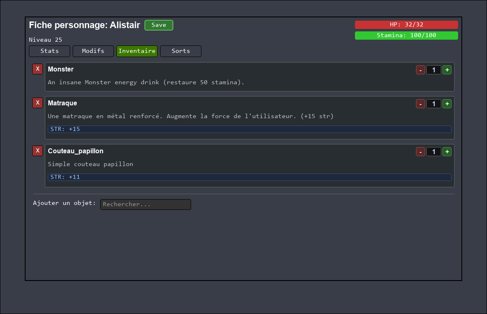 |

| Inventaire: ajout | Onglet Sorts |
|---|---|
| 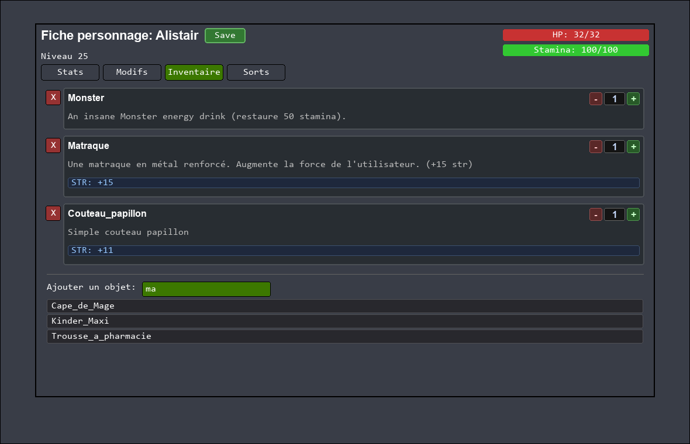 | 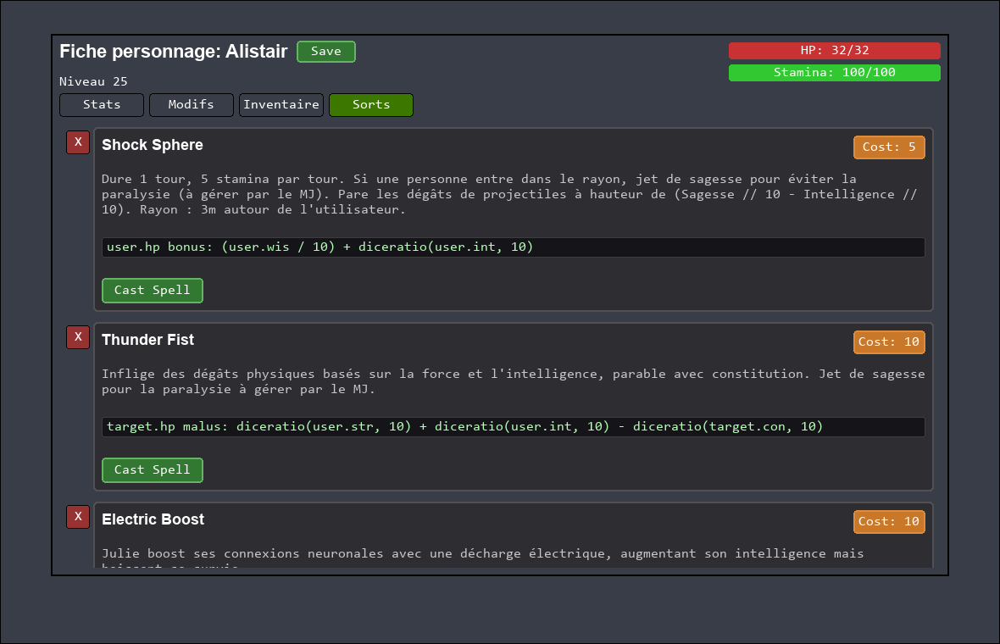 |

| Sorts: ajout |
|---|
|  |

## GIFs de démo

### Flow Cast Spell


### Flow Inventaire (modifs)


### Exemples de fiches

| Alistair | Dexter |
|---|---|
| 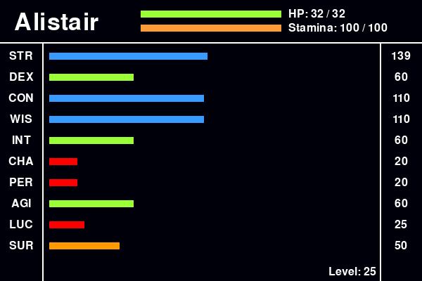 | 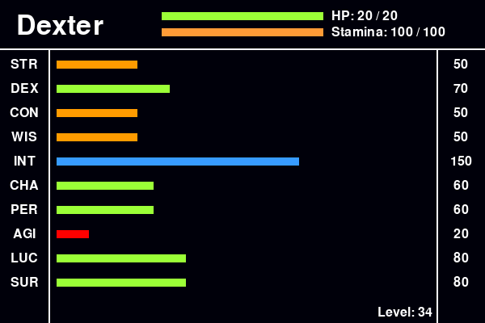 |

| Lena | Saru |
|---|---|
| 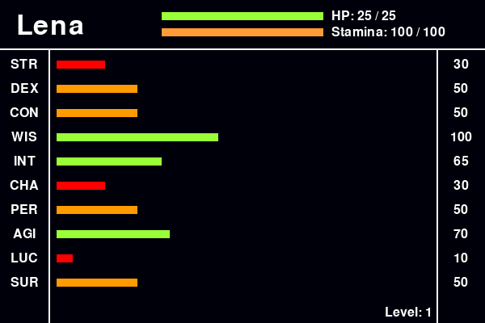 | 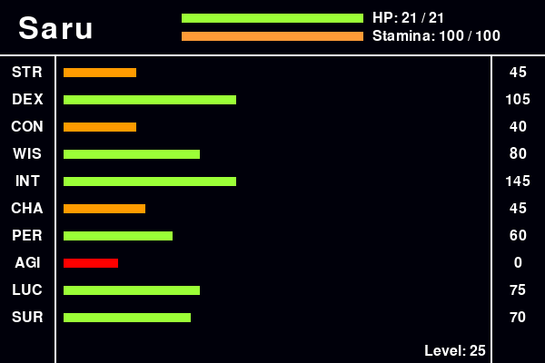 |

## UI ↔ JSON (cards)

Cette section montre la correspondance entre les fichiers JSON et ce qui est affiché dans chaque widget.

### CharacterCard (`CharacterCardWidget`)

Visuel:


Sources JSON:
- `assets/characters/<name>.json`
- (indirect) `assets/items/*.json` pour les bonus inventaire affichés dans les barres

Mapping des champs:

| Zone UI | Donnée utilisée |
|---|---|
| Nom | `character.name` |
| Niveau | calculé depuis stats (`(total_stats - 500) // 5`) |
| Barre HP | `current hp / hp max` (`hp max = 10 + con//10 + wis//10`) |
| Barre Stamina | `stamina courant / stamina max` |
| Boutons `Strike` / `Shoot` | ouvrent les formulaires d’action |
| Bouton `Ouvrir fiche` | ouvre `CharacterSheetWidget` |

### ItemCard (`ItemCardWidget`)

Visuel:


Source JSON:
- `assets/items/<name>.json`

Exemple JSON minimal:

```json
{
  "name": "Matraque",
  "description": "...",
  "modifier": [["str", 15]]
}
```

Mapping des champs:

| Zone UI | Donnée utilisée |
|---|---|
| Titre | `name` |
| Description | `description` |
| Liste modificateurs | `modifier` (chaque tuple `[stat, valeur]`) |
| Quantité | valeur d’inventaire en session |
| Boutons `+` / `-` | ajustent la quantité de l’item |

### SpellCard (`SpellCardWidget`)

Visuel:


Source JSON:
- `assets/spells/<name>.json`

Exemple JSON minimal:

```json
{
  "name": "Railgun",
  "description": "...",
  "cost": 20,
  "effects": [
    {
      "target": "target",
      "target_stat": "hp",
      "effect": "malus",
      "formula": "5 + diceratio(user.int, 20) - diceratio(target.wis, 10)"
    }
  ]
}
```

Mapping des champs:

| Zone UI | Donnée utilisée |
|---|---|
| Titre | `name` |
| Coût | `cost` |
| Description | `description` |
| Lignes d’effet | `effects[]` (`target.target_stat effect: formula`) |
| Bouton `Cast Spell` | ouvre le formulaire de cast (si activé) |

## Tutoriel complet: Fiche personnage

Le widget `CharacterSheetWidget` est accessible depuis `Ouvrir fiche` dans une `CharacterCard`.

### Vue générale

Fonctions globales:
- Titre + nom du personnage
- Bouton `Save` (sauvegarde JSON du personnage)
- Affichage `Niveau`
- Barres `HP` et `Stamina`
- 4 onglets: `Stats`, `Modifs`, `Inventaire`, `Sorts`

Capture:


### Onglet 1 — Stats

Objectif: visualiser les stats effectives et lancer des `DiceCheck`.

Ce que tu peux faire:
- Voir `base + modificateurs + bonus inventaire`
- Lire la valeur finale affichée à droite
- Cliquer sur `DiceCheck` pour chaque stat (`STR/DEX/CON/...`)

Capture onglet:


### Popup DiceCheck (dans Stats)

Fonctionnement:
- Animation de d100
- Résultat final `SUCCESS` / `ECHEC`
- Condition: `d100 <= stat courante` (avec gestion des critiques via `DiceCheck`)
- Fermeture via bouton `Fermer` (ou touches de fermeture)

Capture popup:


### Onglet 2 — Modifs

Objectif: éditer les modificateurs de stats et ressources.

Ce que tu peux faire:
- Cliquer sur une zone de saisie (stat ciblée)
- Entrer une valeur signée (`+12`, `-5`, etc.)
- `Entrée` pour valider
- `Échap` pour annuler la saisie en cours
- `↑` / `↓` pour incrémenter/décrémenter rapidement

Colonnes affichées:
- Stat
- Base
- Modificateur éditable
- Total

Capture:


### Onglet 3 — Inventaire

Objectif: gérer les items équipés/portés et leurs quantités.

Ce que tu peux faire:
- Voir une `ItemCard` par item
- Utiliser `+` / `-` dans chaque carte pour changer la quantité
- Retirer un item avec le bouton `X`
- Ajouter un item via la recherche (`Rechercher...`) puis clic sur résultat

Captures:


### Onglet 4 — Sorts

Objectif: gérer les sorts connus et en lancer.

Ce que tu peux faire:
- Voir une `SpellCard` par sort (coût, effets, formule)
- Lancer un sort via `Cast Spell`
- Retirer un sort avec le bouton `X`
- Ajouter un sort via `+ Add Spell` puis recherche

Captures:


### Navigation / interactions utiles

- Scroll molette dans les onglets longs (`Inventaire`, `Sorts`, etc.)
- L’état de la fiche est en mémoire jusqu’à sauvegarde
- `Save` écrit le personnage dans `assets/characters/<nom>.json`
- Le bouton global `Sauvegarder` (fenêtre principale) régénère aussi les fiches PNG

## Fonctionnalités

### 1) Onglet Session

- Affiche le **groupe actif** à gauche
- Affiche **tous les personnages chargés en session** à droite
- Recherche côté groupe + côté personnages chargés
- Boutons `Ajouter` / `Retirer` pour gérer le groupe
- Chaque carte personnage permet:
  - `Strike`
  - `Shoot`
  - `Ouvrir fiche`

### 2) Résolution des actions

- **Strike**: sélection attaquant/cible, saisie manuelle ou lancer auto du `d100`, puis calcul des dégâts
- **Shoot**: même logique que Strike avec stats dédiées
- **Cast Spell**:
  - sélection du lanceur, du sort et de la cible
  - ajout de dés personnalisés pour stats lanceur/cible
  - affichage du log des effets appliqués

### 3) Onglet Ressources

Sous-onglets:
- `Characters`
- `Items`
- `Spells`

Actions disponibles:
- `Create`: crée une ressource JSON
- `Load`: charge une copie de personnage en session (avec nouveau nom)
- `Modify`: édite la ressource sélectionnée
- `Remove`: supprime le fichier JSON sélectionné (confirmation)

### 4) Sauvegarde

Le bouton `Sauvegarder` (en haut de la fenêtre):
- sauvegarde chaque personnage chargé dans `assets/characters`
- régénère sa fiche PNG dans `assets/sheets`

## Installation

### Prérequis

- Python `3.10+`
- `pygame`

### Setup (Windows PowerShell)

```powershell
python -m venv .venv
.\.venv\Scripts\Activate.ps1
pip install pygame
```

### Setup (Linux/macOS)

```bash
python -m venv .venv
source .venv/bin/activate
pip install pygame
```

## Utilisation rapide

### Lancer l’app

```bash
python app.py
```

### Workflow conseillé

1. Aller dans `Ressources` → `Characters`
2. Sélectionner un personnage puis `Load` pour le charger en session (nom de copie)
3. Aller dans `Session` pour ajouter les personnages au groupe
4. Utiliser `Strike`, `Shoot` ou `Ouvrir fiche`
5. Cliquer sur `Sauvegarder` pour persister les changements

## Structure du projet

```text
app.py                     # Point d'entrée
libs/                      # Logique métier + UI
assets/characters/         # Personnages (JSON)
assets/items/              # Objets (JSON)
assets/spells/             # Sorts (JSON)
assets/sheets/             # Fiches PNG générées
cache/logs/                # Logs d'exécution
```

## Formats JSON

### Character (exemple)

```json
{
  "name": "Alistair",
  "stats": {
    "str": 105,
    "dex": 55,
    "con": 110,
    "int": 30,
    "wis": 100,
    "cha": 20,
    "per": 20,
    "agi": 60,
    "luc": 30,
    "sur": 50,
    "stamina": 100,
    "mental_health": 100,
    "drug_health": 100
  },
  "modifiers": {
    "hp": 0,
    "str": 0,
    "dex": 0,
    "con": 0,
    "int": 0,
    "wis": 0,
    "cha": 0,
    "per": 0,
    "agi": 0,
    "luc": 0,
    "sur": 0,
    "stamina": 0,
    "mental_health": 0,
    "drug_health": 0
  },
  "spells": ["Shock_sphere"],
  "inventory": [["Matraque", 1]]
}
```

### Item (exemple)

```json
{
  "name": "Matraque",
  "description": "...",
  "modifier": [["str", 15]]
}
```

### Spell (exemple)

```json
{
  "name": "Railgun",
  "description": "...",
  "cost": 20,
  "effects": [
    {
      "target": "target",
      "target_stat": "hp",
      "effect": "malus",
      "formula": "5 + diceratio(user.int, 20) - diceratio(target.wis, 10)"
    }
  ]
}
```

## Mécanique des formules de sorts

Les formules supportent:

- opérations: `+`, `-`, `*`, `/`
- parenthèses
- accès stats: `user.<stat>` et `target.<stat>`
- fonctions: `diceratio(...)` et `diceattack(...)`

L’évaluation est sécurisée via parsing AST (pas d’exécution arbitraire de code Python).

## Dépannage

- **Fenêtre qui ne démarre pas**: vérifier que `pygame` est installé dans le bon environnement Python.
- **Aucun personnage en session**: charger des personnages via `Ressources` → `Characters` → `Load`.
- **Pas de fichier de dépendances**: installer au minimum `pygame` manuellement (voir Installation).

---

